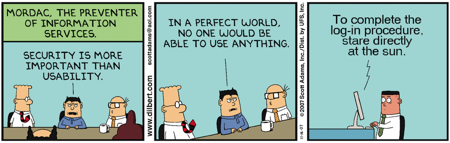
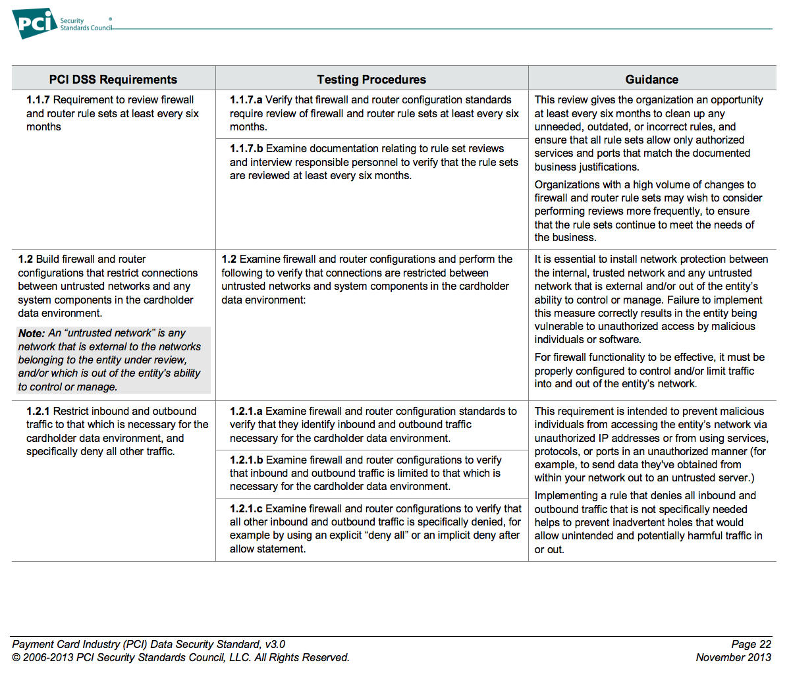
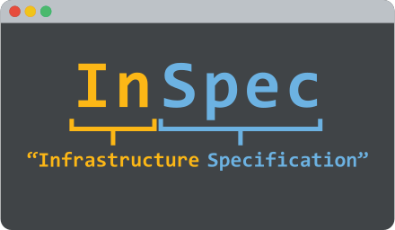
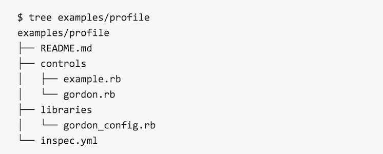
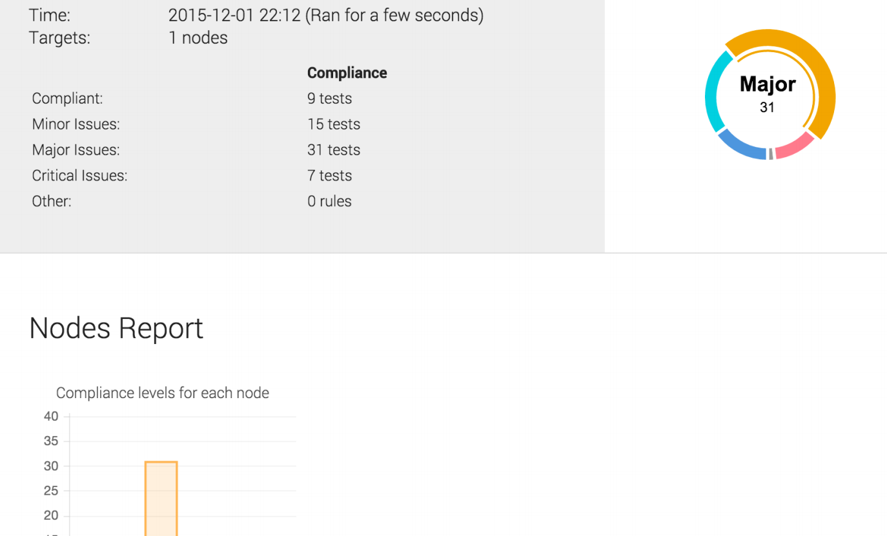

### Who Am I?

* Sean Carolan
* Solutions Architect @ Chef Software
* sean@chef.io
Note:
This is a note.


### Resistance is futile.  You will become compliant.

Note:
Audit and compliance are not fun.  How many of you have ever sat through a PCI audit?  It's about as fun as going to the dentist for a root canal.  Actually that's a bit unfair to the dentist, at least she gives you some painkillers first.  Anyone who builds server or application infrastructure will have to adhere to some security and compliance rules.  Even if you have only a single linux server to manage, you'd be crazy not to do at least some basic hardening before putting it on the Internet.  So what to speak of managing a large fleet of machines that hold health care data or credit card numbers?

This type of work is necessary but it's not fun, nor does it contribute significant value to the end user.  Maybe Mordac here finds this stuff enjoyable.  But the poor sysadmins who have to implement his security policies now have all this extra work on top of their day job maintaining production systems.  Many large organizations struggle even to keep basic operating system patches up to date.  Did you know that a huge percentage of vulnerabilities used to hack into systems are due simply to outdated OS patches? (citation needed)

Of course nobody wants to have their credit card numbers stolen.  Security is a tough job; it's hard to quantify the value added by security process, especially when it slows down deployment of new features and bug fixes.  But it has to be done.  

The developers want to ship new features and sometimes fix bugs in the application.  The operations folks want to not get called at 2am because the site is down.  So they value stability.  And the security folks want to protect the organization's data and intellectual property.  How do we balance all these competing interests?


### Compliance is Everywhere

|               |               |       |
|:----:|:----:|:----:|
| DoD Security Technical Implementation Guides (<span class="yellow">STIG</span>) | Payment Card Industry Data Security Standards (<span class="yellow">PCI</span>) | Sarbanes-Oxley (<span class="yellow">SOX</span>) |
| Health Information Technology for Economic and Clinical Health (<span class="yellow">HITECH</span>) | Health Insurance Portability and Accountability Act of 1996 (<span class="yellow">HIPAA</span>) | Center for Internet Security (<span class="yellow">CIS</span>) |
Note: Compliance and security mandates change often and new ones are created every day. You have to have a system that lets you quickly validate compliance and provide a report that others can consume.  Running scans and then manually remediating machines is not a winning strategy in the age of cloud computing.


### Ok, we will comply.  Now what?
Traditional security and audit processes are

SLOW and CUMBERSOME
Note:
* Build server and application infrastructure
* Just about ready to hand over to ops team
* Security folks insist on scanning everything right before go live
* Ops folks have to take time out to go through a big list of stuff and fix it
* Much Sadness


### Spreadsheet


Note:
Ah, the venerable spreadsheet, the poor man's database.  I want you all to repeat after me:  "Excel is not a database.  Excel is not a database."  Unfortunately spreadsheets are still widely used for tracking things like compliance and audit rules.  If you've ever been on the receiving end of a security or compliance audit you know what I mean.  Who doesn't want an 8000 line spreadsheet full of outdated and inaccurate scan results crammed down their throat?


### PDF


Note:
PDF is also bad!  PDFs are for PRINTING.  The entire purpose of the PDF file is to ensure that formatting is correct when you go to make a hard copy.  PDF is *terrible* for sharing or manipulating data.  Sadly the PDF export is also a standard format among security and audit professionals.  PDFs are generally not machine readable and do not lend themselves to automation.


### XML

```
<Rule id="usgcb-rhel5desktop-rule-2.2.2.5.d" selected="false" weight="10.0" prohibitChanges="false" abstract="false" hidden="false" role="full" severity="unknown">
  <status date="2011-09-30">accepted</status>
  <version update="1"/>
  <title override="0">CCE-15087-0:Disable Mounting of hfs</title>
  <description override="0"> Using the install command inside /etc/modprobe.conf instructs
      the kernel module loading system to run the command specified (here,
      /bin/true) instead of inserting the module in the kernel as normal. This
      effectively prevents usage of these uncommon filesystems.</description>
  <ident system="http://cce.mitre.org">CCE-15087-0</ident>
  <check system="http://oval.mitre.org/XMLSchema/oval-definitions-5" selector="">
    <check-content-ref href="usgcb-rhel5desktop-oval.xml" name="oval:gov.nist.usgcb.rhel:def:20030"/>
  </check>
</Rule>
```
Note:
XML is a bit better than the first two options.  It is great for portability but is still rather inflexible due to the rigid nature of schemas.  It's also a pain in the ass to read and edit, kind of hard on the eyes.  What if you have 2000 compliance rules to go through?


### There must be a better way...
What if we got the auditors, security and ops teams speaking the same language?


### What is InSpec?


Note:
InSpec is a DSL, or Domain Specific Language for defining your security and audit controls. In the same way you use a tool like Chef to define your "Infrastructure as Code", you can now define your compliance profiles as code too. You can use InSpec to examine any node in your infrastructure. The InSpec framework runs locally on the node being inspected. As input, it uses controls you write with the InSpec language. If it detects security, compliance or policy issues they are flagged in a log. You may initiate scans remotely via SSH, or run InSpec locally on the machine you are checking.


### Why not Serverspec?

* Additional metadata (<span class="yellow">impact</span>, <span class="yellow">title</span>, <span class="yellow">description</span>) make it easier to describe & share controls

* Focusing on multi-platform support (<span class="yellow">Windows</span>, <span class="yellow">Docker</span>, <span class="yellow">Linux</span>)

* A command line interface (<span class="yellow">CLI</span>) is required for faster iteration of test code.
Note: Have any of you ever used ServerSpec?  We owe a debt of gratitude to Gosuke Miyashita, AKA Mizzy, who created Serverspec.  Inspec is inspired by Serverspec and aims to be backwards compatible with all its resources.  We needed more extensibility and a focus on multi-platform. We also wanted to bring in the metadata that compliance & security professionals require.


### Anatomy of a control

```
describe sshd_config do
  its('Port') { should eq('22') }
end
```
* <span class="yellow">`describe`</span> is a block that contains at least one test

* <span class="yellow">`sshd_config`</span> is an InSpec resource
Note: There are dozens of pre-built resources. From apache_conf to yum.  The DSL is both machine and human-readable.  Now we have a simple language for expressing compliance and audit requirements.


### Anatomy of a control

```
control 'sshd-8' do
  impact 0.6
  title 'Server: Configure the service port'
  desc '
    Always specify which port the SSH server should listen to.
    Prevent unexpected settings.
  '
  describe sshd_config do
    its('Port') { should eq('22') }
  end
end
```
* <span class="yellow">`'sshd-8'`</span> is the name of the control

* <span class="yellow">`control`</span> must contain at least one `describe` block

* <span class="yellow">`impact`</span>, <span class="yellow">`title`</span>, and <span class="yellow">`desc`</span> define metadata to describe the control

Note:
See how the control is wrapped around the describe block?  This allows us to maintain backwards compatibility with ServerSpec tests, while adding new metadata for things like severity or impact, a description, and a title.  These metadata can easily be exported into standard data formats like JSON or even into Excel spreadsheets, because let's face it, they are not going away anytime soon.  


### Profiles


* <span class="yellow">`inspec.yml`</span> - the profile description (required)
* <span class="yellow">`controls`</span> - contains all tests (required)
* <span class="yellow">`libraries`</span> - contains InSpec resource extensions (optional)
Note:
You can bundle up your controls into profiles.  We have some pre-configured profiles that you can download off of either Github or the Chef Supermarket community site.


### Profile Manifest
```
name: profile
title: InSpec Example Profile
maintainer: Chef Software, Inc.
copyright: Chef Software, Inc.
copyright_email: support@chef.io
license: Apache 2 license
summary: Demonstrates the use of InSpec Compliance Profile
version: 1.0.0
supports:
  - os-family: linux
```

* <span class="yellow">`name`</span> - Identifier of the profile (required)
* Profiles can also be included in other profiles by referring to the name.
Note: **name** - Identifier of the profile (required)</br>**title** - Human-readable name of the profile (optional)</br>**maintainer** - Name of the profile maintainer (optional)</br>**copyright** - Copyright holder (optional)</br>**copyright_email** - Support contact for profile (optional)</br>**license** - License of the profile (optional)</br>**summary** - One-line summary of the profile (optional)</br>**description** - Description of the profile (optional)</br>**version** - Version of the profile (optional)</br>**supports** - A list of supported targets (optional)


### Profile OS Support

```
supports:
  // Runs on any version of Debian Linux
  - os-name: debian

  // Only runs on Ubuntu 14.04
  - os-name: ubuntu
    release: 14.04

  // Targets RedHat, CentOS, Oracle Linux ...
  - os-family: redhat
```
Restrict your profiles to only support targeted operating systems.


### Profile Inheritance
```
include_controls 'cis-level-1' do

  skip_control "cis-fs-2.1"
  skip_control "cis-fs-2.2"

  control "cis-fs-2.7" do
    impact 1.0
  ...

end
```
Include all controls from external profiles and skip specific controls if necessary.
Note: You can import SCAP format (XML) profiles as well!


### Profile Control Inclusion
```
require_controls 'cis-level-1' do

  control "cis-fs-2.1"
  control "cis-fs-2.2"

end
```
If you just need a few controls from a profile, you can require just specific controls.


### Profile Validation & Distribution
```
$ inspec check examples/profile
```

Check your profile syntax with the <span class="yellow">`inspec check`</span> command.

```
# will generate a example-profile.tar.gz
$ inspec archive examples/profile

# will generate a example-profile.zip
$ inspec archive examples/profile --zip
```

Package and redistribute using <span class="yellow">`gzip`</span>, <span class="yellow">`bzip2`</span>, or <span class="yellow">`xz`</span>
Note: InSpec was designed from the ground up with automation in mind.


### Custom Resources
Just like Chef, you can define your own custom InSpec resources if you need them.

```
require 'yaml'

class GordonConfig < Inspec.resource(1)
  name 'gordon_config'

  def initialize
    @path = '/etc/gordon/config.yaml'
    @file = inspec.file(@path)
    return skip_resource "Can't find file \"#{@path}\"" if !@file.file?

    @params = YAML.load(@file.content)
  end

  def method_missing(name)
    @params[name.to_s]
  end
end
```

Include them in <span class="yellow">`libraries`</span> folder in your profiles.


### Running InSpec tests

* Local
```
inspec exec test.rb
```

* Remote via SSH
```
inspec exec test.rb -t ssh://user@hostname
```

* Remote via WinRM
```
inspec exec test.rb -t winrm://Administrator@windowshost --password 'password'
```

* Docker, Docker, Docker
```
inspec exec test.rb -t docker://container_id
```


### Visualize results with Chef Compliance


Note: Chef Compliance is a premium feature for paid Chef subscribers.  InSpec is open source and free for anyone to use.  Chef Compliance adds some extra features like scheduled scans, report history, parallel scans of groups of machines, and more.


### Demo
Note:  Let's take a quick look so you can see how easy it is to get started with InSpec.


### More Information

* The Road to InSpec - https://www.chef.io/blog/2015/11/04/the-road-to-inspec/
* InSpec - https://github.com/chef/inspec
* InSpec Reference - https://docs.chef.io/inspec_reference.html


### Thank You!

What questions do you have?
